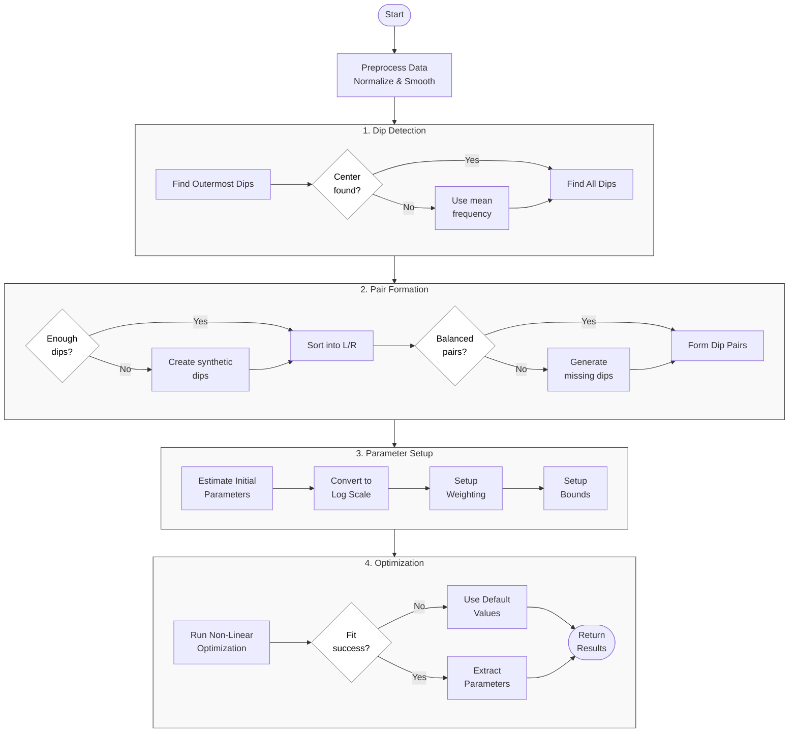

This project investigates improvements for fitting Lorentzian dips in Optically Detected
Magnetic Resonance (ODMR) spectra from NV centers in diamond. Two algorithms were
developed: the Bimodal Lorentzian Spectral Fitting Algorithm (BLSFA) for double-dip
scenarios and the Multimodal Lorentzian Spectral Fitting Algorithm (MLSFA) for complex
multi-dip spectra. Both algorithms implement strategic parameter log-scaling for amplitude
and width variables while maintaining linear frequency parameters, robust initial parameter
estimation based on spectral characteristics, and constrained trust region optimization
methods with the option for Levenberg-Marquardt to enhance convergence reliability. The
BLSFA achieves computational efficiency (≈ 1,500 pixels/second) with success rates
exceeding 99%, effectively eliminating outliers present in previous methods. The MLSFA
extends capabilities to handle multiple dips by implementing specialized weighting systems
that prioritize physically relevant spectral regions during optimization, though at higher
computational cost. A comprehensive graphical interface was developed featuring a pixel
averaging technique that substitutes low-quality pixels with values from surrounding
high-quality pixels, significantly improving visualization while preserving physical significance.
Machine learning approaches (branched neural network and XGBoost) were also explored but
revealed fundamental limitations in capturing the physical interdependencies of Lorentzian
parameters despite extensive hyperparameter optimization. Traditional curve fitting
approaches proved superior, though future hybrid methods may be explored. The algorithms
and visualization tools developed enable more reliable parameter extraction for quantum
sensing applications

## Bimodal Lorentzian Spectral Fitting Algorithm Flowchart

## Multimodal Lorentzian Spectral Fitting Flowchart

