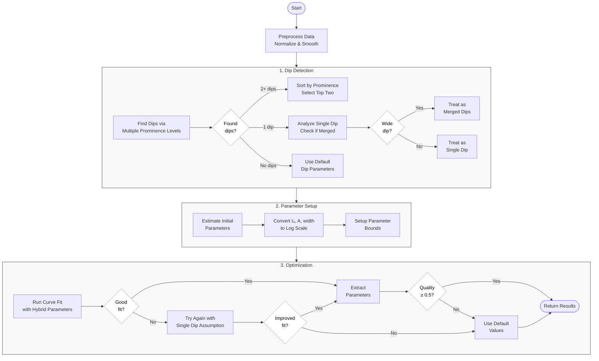

Investigating imporvement possibilities for fitting Lorentzian dips in ODMR. From 2D ODMR scan data, frequency sweeps are performed at every pixel. In these frequency sweeps, the photoluminescence is measured as a function of frequency. These sweeps show dips in the frequency, and that’s where we are mostly interested. Typically, the sweep spectra show 2 dips but may display up to 8 dips or clusters of dips. These dips have to be fitted. The dips are Lorentzian dips, and the fitting may fail when there are multiple dips, and you don’t know how many to expect.

## Bimodal Lorentzian Spectral Fitting Algorithm Flowchart

## Multimodal Lorentzian Spectral Fitting Flowchart

